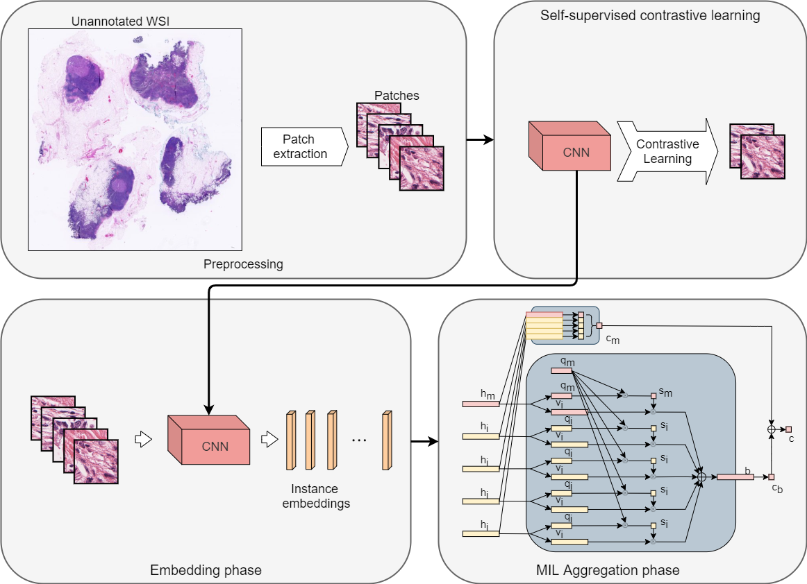
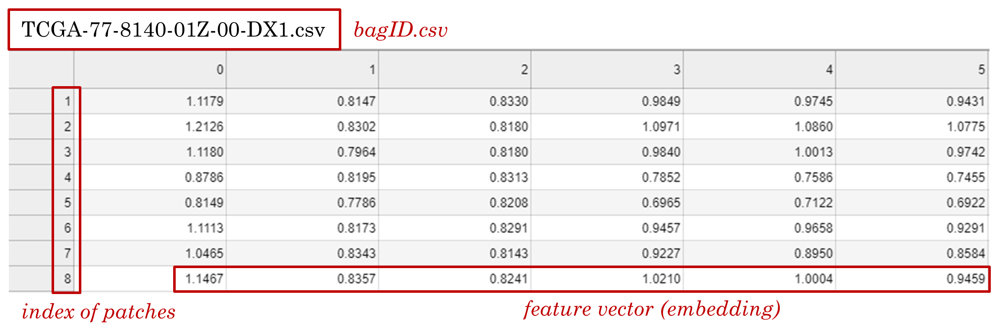
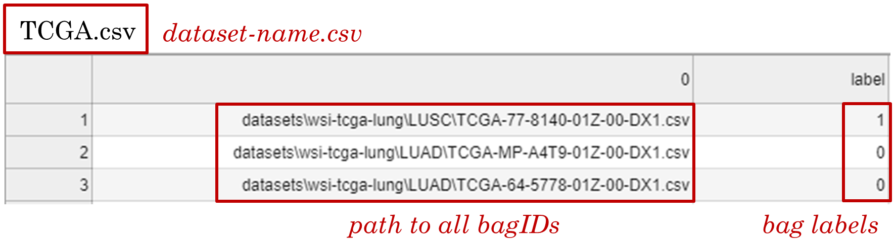

# DSMIL: Dual-stream multiple instance learning networks for tumor detection in Whole Slide Image
Pytorch implementation for the multiple instance learning model described in the paper [Dual-stream Multiple Instance Learning Network for Whole Slide Image Classification with Self-supervised Contrastive Learning](https://arxiv.org/abs/2011.08939) (_CVPR 2021, accepted for oral presentation_).  

<div align="center">
  
</div>

<div align="center">
  
</div>

## Installation
Install [anaconda/miniconda](https://docs.conda.io/en/latest/miniconda.html)  
Required packages
```
  $ conda env create --name dsmil --file env.yml
  $ conda activate dsmil
```
Install [PyTorch](https://pytorch.org/get-started/locally/)  
Install [OpenSlide and openslide-python](https://pypi.org/project/openslide-python/).  
[Tutorial 1](https://openslide.org/) and [Tutorial 2 (Windows)](https://www.youtube.com/watch?v=0i75hfLlPsw).  

## Download feature vectors for MIL network
MIL benchmark datasets can be downloaded via:
```
  $ python download.py --dataset=mil
```

Precomputed features for [TCGA Lung Cancer dataset](https://portal.gdc.cancer.gov/repository?filters=%7B%22op%22%3A%22and%22%2C%22content%22%3A%5B%7B%22op%22%3A%22in%22%2C%22content%22%3A%7B%22field%22%3A%22files.cases.primary_site%22%2C%22value%22%3A%5B%22bronchus%20and%20lung%22%5D%7D%7D%2C%7B%22op%22%3A%22in%22%2C%22content%22%3A%7B%22field%22%3A%22files.data_format%22%2C%22value%22%3A%5B%22svs%22%5D%7D%7D%2C%7B%22op%22%3A%22in%22%2C%22content%22%3A%7B%22field%22%3A%22files.experimental_strategy%22%2C%22value%22%3A%5B%22Diagnostic%20Slide%22%5D%7D%7D%5D%7D) can be downloaded via:  
```
  $ python download.py --dataset=tcga
```
Precomputed features for [Camelyon16 dataset](https://camelyon16.grand-challenge.org/Data/)
```
  $ python download.py --dataset=c16
```
This dataset requires 30GB of free disk space.

## Training on default datasets.
### MIL benchmark datasets
>Train DSMIL on standard MIL benchmark dataset:
```
  $ python train_mil.py
```
>Switch between MIL benchmark dataset, use option:
 ```
 [--datasets]      # musk1, musk2, elephant, fox, tiger
 ```
>Other options are available for learning rate (--lr=0.0002), cross validation fold (--cv_fold=10), weight-decay (--weight_decay=5e-3), and number of epochs (--num_epoch=40).  
### WSI datasets 
>Train DSMIL on TCGA Lung Cancer dataset (precomputed features):
 ```
  $ python train_tcga.py --dataset=TCGA-lung-default
```
>Train DSMIL on Camelyon16 dataset (precomputed features):
 ```
  $ python train_tcga.py --dataset=Camelyon16 --num_classes=1
```
Useful arguments:
```
[--num_classes]       # Number of non-negative classes
[--feats_size]        # Size of feature vector (depends on the CNN backbone)
[--lr]                # Initial learning rate [0.0002]
[--num_epochs]        # Number of training epochs [200]
[--weight_decay]      # Weight decay [5e-3]
[--dataset]           # Dataset folder name
[--split]             # Training/validation split [0.2]
[--dropout_patch]     # Randomly dropout a portion of patches and replace with duplicates during training [0]
[--dropout_node]      # Randomly dropout a portion of nodes in the value vector generation network during training [0]
```

## Testing and generating detection maps from WSI
### TCGA dataset
>Download some testing slides:  
```
  $ python download.py --dataset=tcga-test
```
>You might need to unzip the [file](https://uwmadison.box.com/shared/static/q4d9fr93wmllf1navjf2ghc9b0pmzf2a.zip) manually. [7-zip](https://www.7-zip.org/) might be required for unzipping in Linux.
>To crop the WSIs into patches, run:  
```
  $ python test_crop_single.py --dataset=tcga
```  
>A folder containing all patches for each WSI will be created at `./test/patches`.  
>After the WSIs are cropped, run the testing script:
```
  $ python testing_tcga.py
```   
>The thumbnails of the WSIs will be saved in `./test/thumbnails`.  
>The detection color maps will be saved in `./test/output`.  
>The testing pipeline will process every WSI placed inside the `./test/input` folder. The slide will be detected as a LUAD, LUSC, or benign sample.
### Camelyon16 dataset
> Generating detection maps for Camelyon16 is similar. Direct download [link](https://uwmadison.box.com/shared/static/qs717clgaux5hx2mf5qnwmlsoz2elci2.zip) for the sample slides.
```
  $ python download.py --dataset=c16-test
  $ python test_crop_single.py --dataset=c16
  $ python testing_c16.py
```

## Processing raw WSI data
If you are processing WSI from raw images, you will need to download the WSIs first.

**Download WSIs.**  
* >**From GDC data portal.** You can use [GDC data portal](https://docs.gdc.cancer.gov/Data_Transfer_Tool/Users_Guide/Getting_Started/) with a manifest file and configuration file. The raw WSIs take about 1TB of disc space and may take several days to download. Please check [details](https://docs.gdc.cancer.gov/Data_Transfer_Tool/Users_Guide/Getting_Started/) regarding the use of TCGA data portal. Otherwise, individual WSIs can be download manually in GDC data portal [repository](https://portal.gdc.cancer.gov/repository?filters=%7B%22op%22%3A%22and%22%2C%22content%22%3A%5B%7B%22content%22%3A%7B%22field%22%3A%22files.cases.primary_site%22%2C%22value%22%3A%5B%22bronchus%20and%20lung%22%5D%7D%2C%22op%22%3A%22in%22%7D%2C%7B%22content%22%3A%7B%22field%22%3A%22files.data_format%22%2C%22value%22%3A%5B%22svs%22%5D%7D%2C%22op%22%3A%22in%22%7D%2C%7B%22op%22%3A%22in%22%2C%22content%22%3A%7B%22field%22%3A%22files.experimental_strategy%22%2C%22value%22%3A%5B%22Diagnostic%20Slide%22%5D%7D%7D%5D%7D)  
* >**From Google Drive.** The svs files are also [uploaded](https://drive.google.com/drive/folders/1UobMSqJEqINX2izxrwbgprugjlTporSQ?usp=sharing). The dataset contains in total 1053 slides, including 512 LUSC and 541 LUAD. 10 low-quality LUAD slides are discarded. 

**Sort svs files in the folder.**
Separate LUAD and LUSC slides according to the IDs and place the files into folder `WSI/TCGA-lung/LUAD` or `WSI/TCGA-lung/LUSC`. 

**Prepare the patches.**  
>We will be using [OpenSlide](https://openslide.org/), a C library with a [Python API](https://pypi.org/project/openslide-python/) that provides a simple interface to read WSI data. We refer the users to [OpenSlide Python API document](https://openslide.org/api/python/) for the details of using this tool.  
>The patches could be saved in './WSI/TCGA-lung/pyramid' in a pyramidal structure for two magnification levels. The first magnification level is level 0, which corresponds to a base magnification specified by `-b`. For example, to extract patches at 20x and 5x magnifications, run:  
```
  $ python deepzoom_tiler.py -m 0 2 -b 20
```
>Or, the patches could be cropped at a single level magnification and saved in './WSI/TCGA-lung/single'. For example, extract patches at 10x magnification:  
```
  $ python deepzoom_tiler.py -m 0 -b 10
```
>Camelyon16 consists of mixed magnifications so to reproduce:
```
 $ python deepzoom_tiler.py -m 1 -b 20 -d Camelyon16 -v tif
```

**Train the embedder.**  
>We provided a modified script from this repository [Pytorch implementation of SimCLR](https://github.com/sthalles/SimCLR) For training the embedder.  
Navigate to './simclr' and edit the attributes in the configuration file 'config.yaml'. You will need to determine a batch size that fits your gpu(s). We recommend using a batch size of at least 512 to get good simclr features. The trained model weights and loss log are saved in folder './simclr/runs'.  
>If patches are cropped in single magnification.  
```
  cd simclr
  $ python run.py
```
>If patches are cropped in multiple magnifications, the embedder for each magnification needs to be trained separately to achieve better results.  
```
  $ python run.py --multiscale=1 --level=low
  $ python run.py --multiscale=1 --level=high
```
> Otherwise, you could use the trained embedder for [Camelyon16](https://drive.google.com/drive/folders/14pSKk2rnPJiJsGK2CQJXctP7fhRJZiyn?usp=sharing) and [TCGA](https://drive.google.com/drive/folders/1Rn_VpgM82VEfnjiVjDbObbBFHvs0V1OE?usp=sharing)  

**Compute the features.**  
>Compute the features for single magnification:  
```
  $ cd ..
  $ python compute_feats.py --dataset=TCGA-lung
```
>The last trained embedder will be used by default. To use a specific embedder, set the option `--weights=[RUN_NAME]`, where `[RUN_NAME]` is a folder name inside `simclr/runs/`. 
>Or, compute the features for multiple magnifications:  
```
  $ python compute_feats.py --dataset=TCGA-lung --magnification=tree
```
To use a specific embedder for each magnification, set option `--weights_low=[RUN_NAME]` (embedder for low magnification) and `--weights_high=[RUN_NAME]` (embedder for high magnification).  
>To use ImageNet pretrained CNN for feature computing (batch normalization needed):
```
  $ python compute_feats.py --weights=ImageNet --norm_layer=batch
```
>Specify the argument `--magnification=high` or `--magnification=low` if the patches are cropped in multi-magnifications but only one magnification is to be computed.

**Start training.**  
```
  $ python train_tcga.py --dataset=TCGA-lung
```
**Regarding multiscale features**  
You can download the precomputed features here:   [Camelyon16](https://drive.google.com/drive/folders/1wHyaZkpgVGSoxPpaCeUCAFGhxcS9ZZEA?usp=sharing)  [TCGA](https://drive.google.com/drive/folders/1v0ZEgSIYgriYuRn_O2p0t3RXdFHtiA61?usp=sharing)  
At training, use
```
  $ python train_tcga.py --feats_size=1024 --dataset=[DATASET_NAME]  --num_classes=[NUMBER_OF_CLASSES]
```

## Training on your own datasets
1. Place WSI files as `WSI\[DATASET_NAME]\[CATEGORY_NAME]\[SLIDE_FOLDER_NAME] (optional)\SLIDE_NAME.svs`. 
> For binary classifier, the negative class should have `[CATEGORY_NAME]` at index `0` when sorted alphabetically. For multi-class classifier, if you have a negative class (not belonging to any of the positive classes), the folder should have `[CATEGORY_NAME]` at **the last index** when sorted alphabetically. The naming of the class folders does not matter if you do not have a negative class.
2. Crop patches.  
```
  $ python deepzoom_tiler.py -m 0 -b 20 -d [DATASET_NAME]
```
>Set flag `-m [LEVEL 1] [LEVEL 2]` to crop patches from multiple magnifications. 
3. Train an embedder.  
```
  $ cd simclr
  $ python run.py --dataset=[DATASET_NAME]
```
>Set flag `--multiscale=1` and flag `--level=low` or `--level=high` to train an embedder for each magnification if the patches are cropped from multiple magnifications.   
4. Compute features using the embedder.  
```
  $ cd ..
  $ python compute_feats.py --dataset=[DATASET_NAME]
```
>Set flag `--magnification=tree` to compute the features for multiple magnifications.
>This will use the last trained embedder to compute the features, if you want to use an embedder from a specific run, add the option `--weights=[RUN_NAME]`, where `[RUN_NAME]` is a folder name inside `simclr/runs/`. If you have an embedder you want to use, you can place the weight file as `simclr/runs/[RUN_NAME]/checkpoints/model.pth` and pass the `[RUN_NAME]` to this option. To use a specific embedder for each magnification, set option `--weights_low=[RUN_NAME]` (embedder for low magnification) and `--weights_high=[RUN_NAME]` (embedder for high magnification). The embedder architecture is ResNet18 with **instance normalization**.     

5. Training.
```
  $ python train_tcga.py --dataset=[DATASET_NAME]
```
>You will need to adjust `--num_classes` option if the dataset contains more than 2 positive classes or only 1 positive class and 1 negative class (binary classifier). See the next section for details.  

6. Testing.
```
  $ python attention_map.py --bag_path test/patches --map_path test/output --thres 0.73 0.28
```
Useful arguments:
```
[--num_classes]         # Number of non-negative classes.
[--feats_size]          # Size of feature vector (depends on the CNN backbone).
[--thres]               # List of thresholds for the classes returned by the training function.
[--embedder_weights]    # Path to the embedder weights file (saved by SimCLR). Use 'ImageNet' if ImageNet pretrained embedder is used.
[--aggregator_weights]  # Path to the aggregator weights file.
[--bag_path]            # Path to a folder containing folders of patches.
[--patch_ext]            # File extensino of patches.
[--map_path]            # Path of output attention maps.
```

## Folder structures
Data is organized in two folders, `WSI` and `datasets`. `WSI` folder contains the images and `datasets` contains the computed features.
```
root
|-- WSI
|   |-- DATASET_NAME
|   |   |-- CLASS_1
|   |   |   |-- SLIDE_1.svs
|   |   |   |-- ...
|   |   |-- CLASS_2
|   |   |   |-- SLIDE_1.svs
|   |   |   |-- ...
```
Once patch extraction is performed, `sinlge` folder or `pyramid` folder will appear.
```
root
|-- WSI
|   |-- DATASET_NAME
|   |   |-- single
|   |   |   |-- CLASS_1
|   |   |   |   |-- SLIDE_1
|   |   |   |   |   |-- PATCH_1.jpeg
|   |   |   |   |   |-- ...
|   |   |   |   |-- ...
|   |   |-- pyramid
|   |   |   |-- CLASS_1
|   |   |   |   |-- SLIDE_1
|   |   |   |   |   |-- PATCH_LOW_1
|   |   |   |   |   |   |-- PATCH_HIGH_1.jpeg
|   |   |   |   |   |   |-- ...
|   |   |   |   |   |-- ...
|   |   |   |   |   |-- PATCH_LOW_1.jpeg
|   |   |   |   |   |-- ...
|   |   |   |   |-- ...
```
Once feature computing is performed, `DATASET_NAME` folder will appear inside `datasets` folder.
```
root
|-- datasets
|   |-- DATASET_NAME
|   |   |-- CLASS_1
|   |   |   |-- SLIDE_1.csv
|   |   |   |-- ...
|   |   |-- CLASS_2
|   |   |   |-- SLIDE_1.csv
|   |   |   |-- ...
|   |   |-- CLASS_1.csv
|   |   |-- CLASS_2.csv
|   |   |-- DATASET_NAME.csv
```
  
## Feature vector csv files explanation
1. For each bag, there is a .csv file where each row contains the feature of an instance. The .csv is named as "_bagID_.csv" and put into a folder named "_dataset-name_/_category_/".  

<div align="center">
  
</div>  

2. There is a "_dataset-name_.csv" file with two columns where the first column contains the paths to all _bagID_.csv files, and the second column contains the bag labels.  

<div align="center">
  
</div>  

3. Labels.
> For binary classifier, use `1` for positive bags and `0` for negative bags. Use `--num_classes=1` at training.  
> For multi-class classifier (`N` positive classes and one optional negative class), use `0~(N-1)` for positive classes. If you have a negative class (not belonging to any one of the positive classes), use `N` for its label. Use `--num_classes=N` (`N` equals the number of **positive classes**) at training.


## Citation
If you use the code or results in your research, please use the following BibTeX entry.  
```
@inproceedings{li2021dual,
  title={Dual-stream multiple instance learning network for whole slide image classification with self-supervised contrastive learning},
  author={Li, Bin and Li, Yin and Eliceiri, Kevin W},
  booktitle={Proceedings of the IEEE/CVF Conference on Computer Vision and Pattern Recognition},
  pages={14318--14328},
  year={2021}
}


